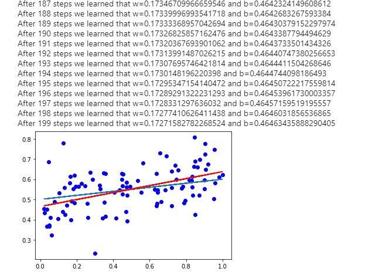
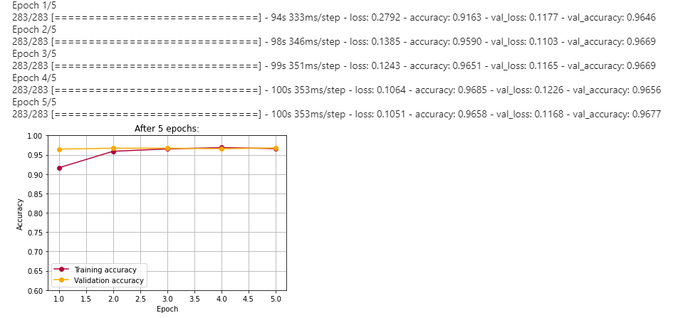

# What is it
This is one of my repos for learning and this one is focused on 
Artificial Neural Networks, machine/deep learning and AI

# What does it contain
Contains a couple of scripts that might help you and me later when learning
machine/deep learning. As a beginning one should probably go to 
[linear_regression.py](https://github.com/ilya-maier/ann_course/blob/master/linear_regression.py)
as it explains some of the most important concepts of an ANN, such as:
- loss function
- gradient
- learning rate
- training process

The next level would be to look at some of the CNN models for imagenette and imagewoof datasets.
There you fill find some of the most important concepts of a CNN:
- convolutional and pooling layers
- batch normalization
- dropout
- data augmentation
- transfer learning
- etc.

# What is it based on
I basically started with 2 courses that could be found in the Internet. 

The first one is a course from Hasso Plattner Institute (in German): [neuralnets2020](https://open.hpi.de/courses/neuralnets2020/)

The second course is from Vadim Karpusenko (Microsoft) that could be found at Frontend Masters:
[A Practical Guide to Machine Learning with TensorFlow 2.0 & Keras](https://frontendmasters.com/courses/practical-machine-learning/) 

P.S. thanks [@bartekpacia](https://github.com/bartekpacia) :)

# Some insights:

# Some interesting articles/videos for further study:
- [Getting Started with TensorFlow 2.0 (Google I/O'19)](https://www.youtube.com/watch?v=lEljKc9ZtU8)
- [Machine Learning Zero to Hero (Google I/O'19)](https://www.youtube.com/watch?v=VwVg9jCtqaU)
- [Activation Functions Explained - GELU, SELU, ELU, ReLU and more](https://mlfromscratch.com/activation-functions-explained/#/)
- [Deep Learning #3: More on CNNs & Handling Overfitting](https://towardsdatascience.com/deep-learning-3-more-on-cnns-handling-overfitting-2bd5d99abe5d)
- [ImageNet: VGGNet, ResNet, Inception, and Xception with Keras](https://www.pyimagesearch.com/2017/03/20/imagenet-vggnet-resnet-inception-xception-keras/)
